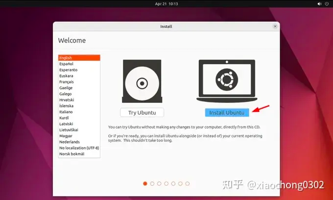
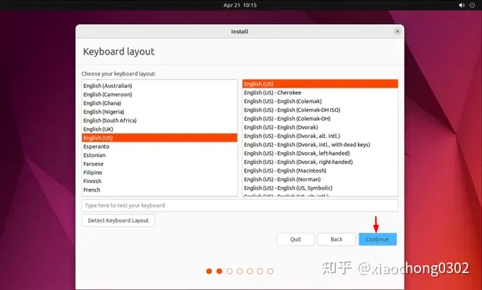
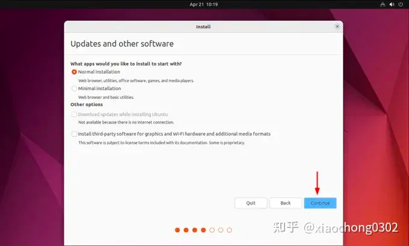
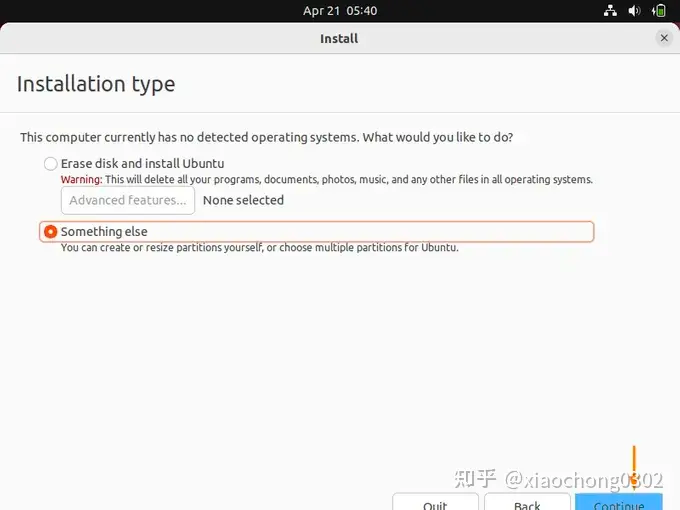
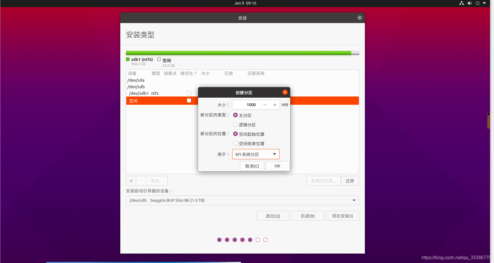
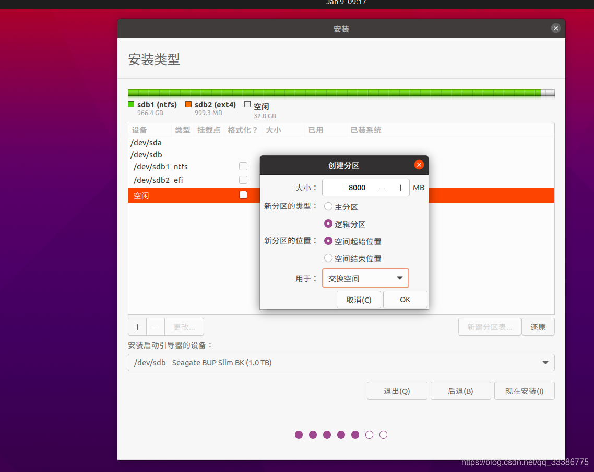
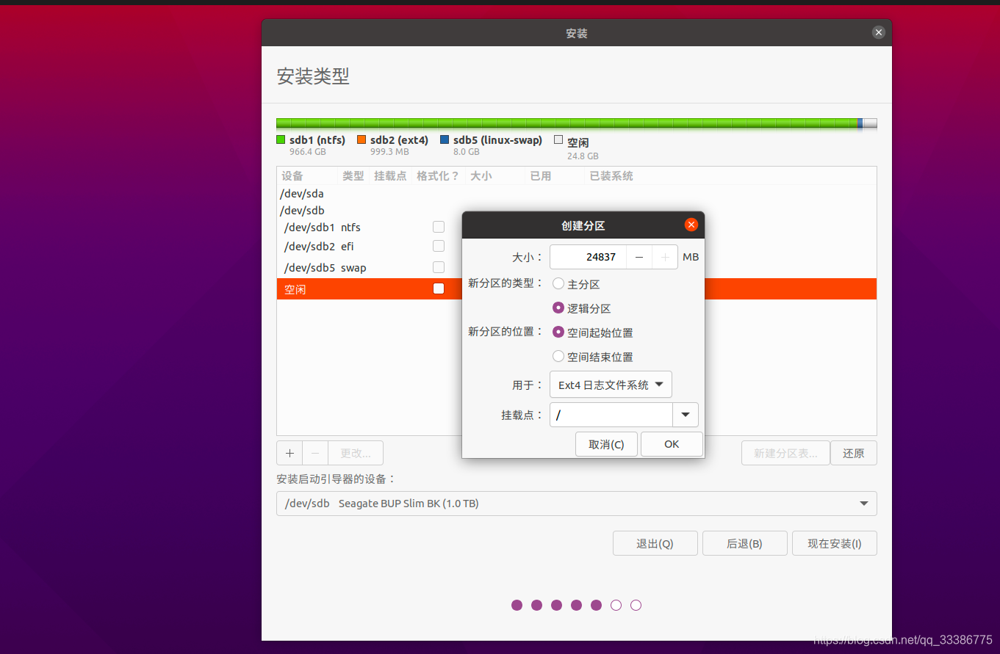
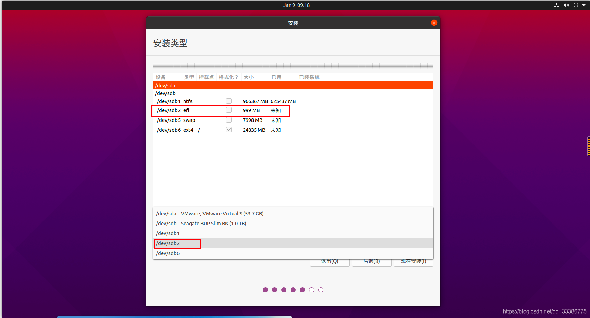

# Ubuntu

## 概述

Ubuntu 是一个基于 Debian Linux 发行版的自由开源操作系统。它的发行方式是在每年的 4 月和 10 月推出一个新版本，每个版本会得到 9 个月的技术支持。Ubuntu 的目标是为了让桌面计算机和服务器变得更加易用和可靠。

Ubuntu 的创始人马克·舍特尔沃斯在 2004 年创立了 Canonical Ltd. 公司，并于同年推出了第一个版本的 Ubuntu。Ubuntu 最初的目标是为普通人提供一个易用的 Linux 发行版，其名称来自非洲南部祖鲁语，意为"人类关怀"。

## 目录说明

| 目录 | 说明 |
|------|------|
| `/bin` | 二进制可执行命令，该目录下存放着普通用户的命令 |
| `/boot` | 启动 Linux 的核心文件 |
| `/data` | 用户用于存放日志等数据的目录 |
| `/dev` | 系统的设备文件，即设备的驱动程序 |
| `/etc` | 系统所有的配置文件都在这个目录中 |
| `/home` | 用户主目录的基点 |
| `/lib` | 存放着和系统运行相关的库文件 |
| `/lost+found` | 这个目录平时是空的，当系统非正常关机而留下的"无家可归"的文件便会储存在这里 |
| `/media` | 存放着可移除的设备，比如软盘，光盘 |
| `/misc` | 储存着一些特殊的字符的定义 |
| `/mnt` | 挂载目录，是系统管理员临时安装文件的系统安装点 |
| `/net` | 存放着和网络相关的一些文件 |
| `/opt` | 主要给源码安装软件时选择的安装目录位置 |
| `/proc` | 存放着用户与内核的交互信息 |
| `/root` | 超级用户的目录 |
| `/sbin` | 系统的管理命令，这里存放的是系统管理员使用的程序 |
| `/selinux` | 主要用来加固操作系统，提高系统的安全性 |
| `/srv` | 系统启动服务时可以访问的数据库目录 |
| `/sys` | 管理设备文件 |
| `/tmp` | 临时文件，重启后自动清空 |
| `/var` | 某些大文件的溢出区，比如各种服务的日志文件 |
| `/usr` | 最大的目录，存放着应用程序和文件 |

## 安装说明

- <https://zhuanlan.zhihu.com/p/135953477> （推荐）
- <https://zhuanlan.zhihu.com/p/569347838>
- <https://zhuanlan.zhihu.com/p/590877041>

### 安装在移动硬盘中

1. **烧录启动盘** — 使用软件 balena Etcher 进行烧录即可。
2. **插入启动盘**，插入移动硬盘，按 F12 选择启动盘启动。
3. 选择 **install ubuntu**。

4. 选择键盘布局。

5. 选择普通安装或者最小安装，一般选择普通安装即可。

6. 选择 **Something else**（其他选项），然后找到自己的移动硬盘，开始创建分区。

7. 右击移动硬盘的空闲（free space）进行分区，需要创建三个分区：

   | 分区类型 | 说明 |
   |----------|------|
   | **efi** | 用于系统启动的引导，记得分区类型要选主分区（Primary） |
   
   | **swap** | 分配交换空间，这里建议和机器的内存一样 |
   
   | **ext4** | 日志文件系统，即是系统存放文件的地方，剩下的全部给这个即可，挂载点需要选择为 `/` |
   

   > ⚠️ **注意**：挂载点需要选择为 `/`，如果忘记选择挂载点就会因为没有主分区导致无法安装。

   

8. **选择启动引导器设备**：一定要选择 efi 那个区。
9.  剩下的按照提示完成即可。

## 常用命令

### apt 工具

Advanced Package Tool（高级软件包工具）。

```bash
# 更新包数据库
sudo apt update

# 更新已安装的软件包
sudo apt upgrade
```

### IP 查看

```bash
ip addr show
```

### 防火墙

```bash
# 查看防火墙状态（关闭：inactive；开启：active）
ufw status

# 开启防火墙
ufw enable

# 关闭防火墙
ufw disable
```

### SSH

```bash
# 安装
apt install openssh-server

# 查看状态
systemctl status ssh
```

### whereis 查找文件

```bash
whereis [options] <查找的文件名>
```

**参数：**

| 参数 | 说明 |
|------|------|
| `-b` | 只查找二进制文件 |
| `-f` | 不显示文件名前的路径名称 |
| `-m` | 只查找说明文件 |
| `-s` | 只查找原始代码文件 |
| `-u` | 查找不包含指定类型的文件 |
| `-B<目录>` | 只在设置的目录下查找二进制文件 |
| `-M<目录>` | 只在设置的目录下查找说明文件 |
| `-S<目录>` | 只在设置的目录下查找原始代码文件 |

### ps 查看进程状态

```bash
ps [option]
```

**常用命令：**

```bash
# 查看所有进程
ps -ef

# 查看指定进程
ps -ef | grep <进程名>
```

**参数：**

| 参数 | 说明 |
|------|------|
| `-e` | 显示所有进程 |
| `-A` | 显示所有进程 |
| `-w` | 显示加宽可以显示较多的资讯 |
| `-a` | 显示当前终端的所有进程 |
| `-u` | 显示进程的用户信息 |
| `-f` | 显示程序间的关系 |

### curl URL 客户端

`curl` 是常用的命令行工具，用来请求 Web 服务器。它的名字就是客户端（client）的 URL 工具的意思。

**博客参考：**

阮一峰：<https://www.ruanyifeng.com/blog/2019/09/curl-reference.html>

**示例：POST 带 JSON 参数：**

```bash
curl -v http://localhost:3000/api.webapp/canWrite -d '{"processDefineKey": "","taskId": "","type": "4"}' -H "Content-Type: application/json" -H 'Authorization:{token}'
```

**参数：**

| 参数 | 说明 |
|------|------|
| `-d` | 用于发送 POST 请求的数据体。使用 `-d` 参数以后，HTTP 请求会自动加上标头 `Content-Type: application/x-www-form-urlencoded`，并且会自动将请求转为 POST 方法，因此可以省略 `-X POST` |
| `-H` | 添加 HTTP 请求的标头，可以用 `-H xxx -H xxx` 添加多个 |
| `-v` | 输出通信的整个过程，可用于调试 |
| `--trace` | 输出通信的整个过程，还会输出原始的二进制数据 |

### cp 复制

```bash
cp <options> <源文件> <目标文件 / 目标目录>
```

**参数：**

| 参数 | 说明 |
|------|------|
| `-a` | 相当于 `-d`、`-p`、`-r` 选项的集合 |
| `-d` | 如果源文件为软链接（对硬链接无效），则复制出的目标文件也为软链接 |
| `-i` | 询问，如果目标文件已经存在，则会询问是否覆盖 |
| `-l` | 把目标文件建立为源文件的硬链接文件，而不是复制源文件 |
| `-s` | 把目标文件建立为源文件的软链接文件，而不是复制源文件 |
| `-p` | 复制后目标文件保留源文件的属性（包括所有者、所属组、权限和时间） |
| `-r` | 递归复制，用于复制目录 |
| `-u` | 若目标文件比源文件有差异，则使用该选项可以更新目标文件，此选项可用于对文件的升级和备用 |

### netstat 端口占用情况

```bash
netstat <options>
```

**常用命令：**

```bash
# 查看已经连接的服务端口
netstat -a

# 查看所有的服务端口
netstat -ap

# 查看指定的端口
netstat -ap | grep 8080
```

### kill 关闭服务

```bash
kill <options> pid
```

**常用命令：**

```bash
kill pid    # 默认 -15，通知程序进行"安全，干净的退出"
kill -9 pid # --慎用！！！-9 表示"无条件退出"，但是对于系统进程和守护进程无效
```

### sftp 文件传输命令

SFTP 是 Secure File Transfer Protocol 的缩写，安全文件传送协议。可以为传输文件提供一种安全的网络的加密方法。SFTP 与 FTP 有着几乎一样的语法和功能。SFTP 为 SSH 的其中一部分，是一种传输档案至 Blogger 伺服器的安全方式。其实在 SSH 软件包中，已经包含了一个叫作 SFTP（Secure File Transfer Protocol）的安全文件信息传输子系统，SFTP 本身没有单独的守护进程，它必须使用 `sshd` 守护进程（端口号默认是 22）来完成相应的连接和答复操作，所以从某种意义上来说，SFTP 并不像一个服务器程序，而更像是一个客户端程序。SFTP 同样是使用加密传输认证信息和传输的数据，所以，使用 SFTP 是非常安全的。但是，由于这种传输方式使用了加密/解密技术，所以传输效率比普通的 FTP 要低得多，如果您对网络安全性要求更高时，可以使用 SFTP 代替 FTP。

```bash
# 连接服务器
sftp <username>@<ip>

# 显示本地路径
lpwd

# 显示远程路径
pwd

# 上传文件
put <本地路径> <远程路径>

# 上传文件夹
put -r <本地路径> <远程路径>

# 下载文件
get <远程路径> <本地路径>
```

### free 查看内存

```bash
free -m   # 以 MB 为单位
free -h   # 显示单位，自动进位
```

**显示信息：**

| 字段 | 说明 |
|------|------|
| `total` | 表示总共有的物理内存（RAM） |
| `used` | 表示物理内存的使用量 |
| `free` | 表示空闲内存 |
| `shared` | 表示共享内存 |
| `buff/cache` | 表示缓存和缓冲内存量；Linux 系统会将很多东西缓存起来以提高性能，这部分内存可以在必要时进行释放，给其他程序使用 |
| `available` | 表示可用内存 |

### 电源操作

```bash
# 关机
sudo shutdown -h now

# 重启
sudo shutdown -r now

# 延迟关机或重启，例如延迟 10 分钟
sudo shutdown -h +10
sudo shutdown -r +10
```

## 环境配置

### JDK

（待补充）

### MySQL 8

```bash
# 安装
sudo apt update
sudo apt install mysql-server

# 查看服务状态
sudo systemctl status mysql

# 默认情况下，MySQL 安装后会启用安全性加固功能
# 根据提示，您可以选择设置密码策略、删除匿名用户、禁止 root 远程登录等操作
sudo mysql_secure_installation
```

先使用 root 权限登录进入，然后创建一个新的用户，因为在 Ubuntu MySQL 8 中 root 用户是动态密码，我们一般不直接使用 root。

```sql
-- 创建用户（username 是你想要创建的用户名，localhost 表示只能通过本地连接访问）
CREATE USER "username"@"localhost" IDENTIFIED BY "password";

-- 授权（*.* 表示所有数据库的所有表）
GRANT ALL PRIVILEGES ON *.* TO "username"@"localhost";

-- 刷新权限
flush privileges;
```

```bash
# 重启 mysql
service mysql restart
```

### Docker

```bash
# 更新 apt 软件包索引，安装软件包以允许 apt 通过 HTTPS 使用存储库
sudo apt update
sudo apt install apt-transport-https ca-certificates curl software-properties-common

# 添加 Docker 的官方 GPG 密钥
curl -fsSL https://download.docker.com/linux/ubuntu/gpg | sudo apt-key add -

# 添加 Docker 的稳定存储库
sudo add-apt-repository "deb [arch=amd64] https://download.docker.com/linux/ubuntu $(lsb_release -cs) stable"

# 更新 apt 软件包索引
sudo apt update

# 安装 docker.io（Ubuntu 官方仓库中提供的 Docker 软件包，包括了 Docker 引擎、客户端、服务端等一系列 Docker 相关的工具和组件）
sudo apt install docker.io

# （可选）安装 Docker Compose 以管理多个 Docker 容器的工具
sudo apt install docker-compose

# 验证 Docker 是否已成功安装
docker --version

# （可选）将当前用户添加到 Docker 用户组，以允许不使用 sudo 运行 Docker 命令
sudo usermod -aG docker $USER
```

### SSH

```bash
sudo apt update
sudo apt install openssh-server
sudo systemctl status ssh
```

## 遇到过的问题

### SSH 连接：Permission denied (publickey)

```bash
# 进入 ssh 配置文件
sudo vim /etc/ssh/sshd_config
```

修改以下配置项：

```ini
# 如果您希望允许使用密码进行 SSH 验证，请将其设置为 "yes"
PasswordAuthentication yes

# 如果希望允许公钥登录，请将其设置为 yes
PubkeyAuthentication yes
```

```bash
# 重启 ssh
sudo service ssh reload
```

### 远程主机标识已更改：WARNING: REMOTE HOST IDENTIFICATION HAS CHANGED

```bash
ssh-keygen -R ${hostName or ip}
```

## 参考链接

- 安装系统到移动硬盘：<https://blog.csdn.net/qq_33386775/article/details/111749677>
- Ubuntu 22.04 安装 VNC Server：<https://www.cnblogs.com/milton/p/16730512.html>
