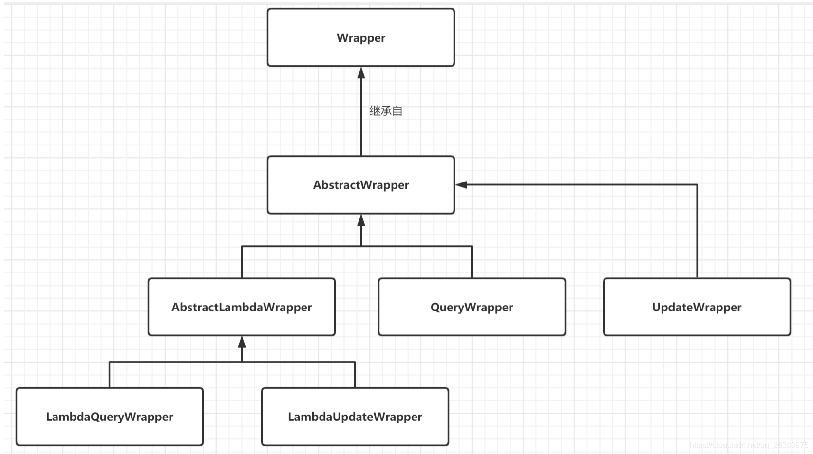
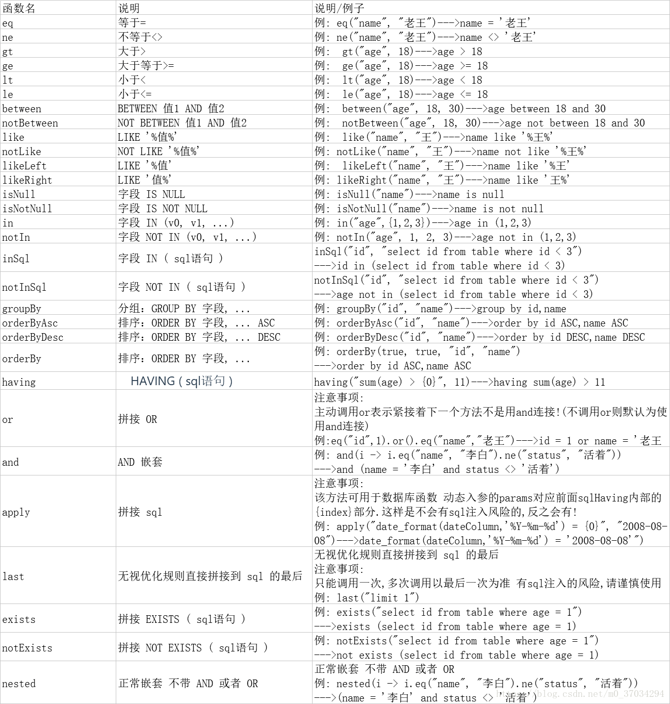

# MyBatis / MyBatis-Plus

## 概述

MyBatis 是一款优秀的持久层框架，它支持自定义 SQL、存储过程以及高级映射。MyBatis-Plus 是 MyBatis 的增强工具，在 MyBatis 的基础上只做增强不做改变，为简化开发、提高效率而生。

## ResultMap

`resultMap` 元素是 MyBatis 中最重要最强大的元素。它可以让你从 90% 的 JDBC ResultSets 数据提取代码中解放出来，并在一些情形下允许你进行一些 JDBC 不支持的操作。实际上，在为一些比如连接的复杂语句编写映射代码的时候，一份 `resultMap` 能够代替实现同等功能的数千行代码。`ResultMap` 的设计思想是，对简单的语句做到零配置，对于复杂一点的语句，只需要描述语句之间的关系就行了。

`resultMap` 可以将查询到的复杂数据，比如多张表的数据、一对一映射、一对多映射等复杂关系聚合到一个结果集当中。

### 使用方式

1. 封装实体类，将关联子表的字段加在封装类上，并写好 get set，必须要有无参构造方法。
2. 编写 `resultMap`。

#### 模板说明

```xml
<!-- column 不做限制，可以为任意表的字段，而 property 须为 type 定义的 pojo 属性 -->
<resultMap id="唯一的标识" type="映射的pojo对象">
  <id column="表的主键字段，或者可以为查询语句中的别名字段" jdbcType="字段类型" property="映射pojo对象的主键属性" />
  <result column="表的一个字段（可以为任意表的一个字段）" jdbcType="字段类型" property="映射到pojo对象的一个属性（须为type定义的pojo对象中的一个属性）"/>
  <association property="pojo的一个对象属性" javaType="pojo关联的pojo对象">
    <id column="关联pojo对象对应表的主键字段" jdbcType="字段类型" property="关联pojo对象的主席属性"/>
    <result column="任意表的字段" jdbcType="字段类型" property="关联pojo对象的属性"/>
  </association>
  <!-- 集合中的 property 须为 ofType 定义的 pojo 对象的属性 -->
  <collection property="pojo的集合属性" ofType="集合中的pojo对象">
    <id column="集合中pojo对象对应的表的主键字段" jdbcType="字段类型" property="集合中pojo对象的主键属性" />
    <result column="可以为任意表的字段" jdbcType="字段类型" property="集合中的pojo对象的属性" />
  </collection>
</resultMap>

<!-- collection 可以直接嵌套别的 sql 语句 -->
<collection column="传递给嵌套查询语句的字段参数" property="pojo对象中集合属性"
            ofType="集合属性中的pojo对象"
            select="嵌套的查询语句 or 调用别的dao中的方法，使用全限定类名.方法名">
</collection>
```

#### 示例

```xml
<resultMap id="modulesMap" type="LowAutoModuleRecord">
    <id property="id" column="id"/>
    <result property="moduleKey" column="module_key" />
    <result property="moduleName" column="module_name" />
    <result property="name" column="name" />
    <result property="pageId" column="page_id"/>
    <result property="containerStyleName" column="container_style_name" />
    <result property="moduleData" column="module_data" />
    <result property="componentId" column="component_id" />
    <result property="componentType" column="component_type" />
    <result property="componentOption" column="component_option" />
    <result property="binding" column="binding" />
    <result property="bindingTarget" column="binding_target" />
    <result property="pid" column="pid" />
    <result property="referenceStyleName" column="reference_style_name" />
    <result property="referenceGatewayName" column="reference_gateway_name" />
    <collection property="moduleProp" column="id" ofType="LowAutoModulePropRecord"
                select="com.jfeat.module.lc.lc_low_auto_module_prop.services.domain.dao.QueryLowAutoModulePropDao.listModuleProp" />
</resultMap>
```

**要点说明：**

- `<association>`：可以处理一对一，或者多对一的关系。
- `<collection>`：是一个列表，可以处理一对多的关系。
- 甚至可以不需要 `<collection>` / `<association>` 中的 `select` 参数，可以在 SQL 中直接连表，然后映射到 `property` 指定的 pojo 中。

## foreach

MyBatis 的 `foreach` 标签应用于多参数的交互，如：多参数（相同参数）查询、循环插入数据等。

**属性说明：**

| 属性 | 说明 |
|------|------|
| `collection` | 参数名称，根据 Mapper 接口的参数名确定，也可以使用 `@Param` 注解指定参数名 |
| `item` | 参数调用名称，通过此属性来获取集合单项的值 |
| `open` | 相当于 prefix，即在循环前添加前缀 |
| `close` | 相当于 suffix，即在循环后添加后缀 |
| `index` | 索引、下标 |
| `separator` | 分隔符，每次循环完成后添加此分隔符 |

**示例：**

```xml
<foreach collection="ids" item="item" open="(" close=")" separator=",">
    #{item}
</foreach>
```

## if

`<if>` 搭配 `<where>` 使用时，`<where>` 可以将第一个 `AND` 去掉，这样就不需要 `where 1=1` 这样的操作。

在 MyBatis 中使用小于判断字符会有冲突（`<`），所以可以使用一些关键字：

- `&gt;`：大于
- `&lt;`：小于

或者使用 `<![CDATA[...]]>`，里面的内容将不被解析。

## choose / when / otherwise

- `<choose>`：相当于 Java 中的 `switch`。
- `<when>`：表示当 `test` 中的条件满足则输出当前 `<when>` 中的 SQL，并跳出 `<choose>`。
- `<otherwise>`：表示当所有的 `<when>` 都没有满足条件则输出 `<otherwise>` 中的 SQL。

## Wrapper（条件构造器）

在 MyBatis-Plus 中，Wrapper 是用于构建 SQL 查询条件的抽象接口，可以封装 SQL 对象，包括 where 条件、order by 排序、select 等。

个人风格趋向于通过 `xxxMapper` 继承 `BaseMapper<xxx>`，而不使用实体类继承 `Model<xxx>`，将查询数据库的职责交给 Mapper 而不是使用实体来查询。



### 条件构造器类层次


| 类 | 说明 |
|------|------|
| `Wrapper` | 条件构造抽象类，最顶端父类 |
| `AbstractWrapper` | 用于查询条件封装，生成 SQL 的 where 条件 |
| `AbstractLambdaWrapper` | Lambda 语法使用 Wrapper，统一处理解析 lambda 获取 column |
| `LambdaQueryWrapper` | 用于 lambda 语法使用的查询 Wrapper |
| `LambdaUpdateWrapper` | Lambda 更新封装 Wrapper |
| `QueryWrapper` | Entity 对象封装操作类，不使用 lambda |
| `UpdateWrapper` | Update 条件封装，用于 Entity 对象更新操作 |

### 使用说明

Mapper 接口继承 `BaseMapper<实体类>`，基本的表单查询都已经封装好了。

本质上依然还是 SQL，只不过是封装好了。如果想要打印日志，可以在 `application.yml` 中配置：

```yaml
mybatis-plus:
  configuration:
    log-impl: org.apache.ibatis.logging.stdout.StdOutImpl
```

### QueryWrapper

```java
QueryWrapper<Entity> entityWrapper = new QueryWrapper<>();
// 使用 queryWrapper 中的方法封装 sql
entityWrapper.eq("name", "lisa");
// 使用 mapper 查询，selectList 是继承的 BaseMapper 的方法
List<Entity> entitys = entityMapper.selectList(entityWrapper);
```

### UpdateWrapper

```java
xxxMapper.update(entity, updateWrapper); // 切记设定 where 条件，否则会全表更新
xxxMapper.updateById(entity);
```

更新会默认忽略 `null` 的字段更新，有几种方式解决：

- **推荐方法**：自定义 update SQL。
- **强烈不推荐**：使用 `@TableField(strategy = FieldStrategy.IGNORED)` 注解，在使用中容易不小心将数据设为 `null`。

### LambdaQueryWrapper

基本和上面的操作一致，但是可以使用 `Model::getName` 这样的方法引用来指定字段，避免写错字段，个人比较推荐该方法。

## Page（分页）

Page 对象结构：

| 字段 | 说明 |
|------|------|
| `records` | 用来存放查询出来的数据 |
| `total` | 返回记录的总数 |
| `size` | 每页显示条数，默认 10 |
| `current` | 当前页，默认 1 |
| `orders` | 排序字段信息 |
| `optimizeCountSql` | 自动优化 COUNT SQL，默认 `true` |
| `isSearchCount` | 是否进行 count 查询，默认 `true` |
| `hitCount` | 是否命中 count 缓存，默认 `false` |

Mapper 的方法使用 Page 的时候可以使用两种返回参数：

- `Page<Model>`：会返回上述的 page 对象，列表在 `records` 中。
- `List<Model>`：会直接返回一个已经分好页的列表。

## 特殊符号的转义字符

| 符号 | 转义 |
|------|------|
| 小于号 `<` | `&lt;` |
| 大于号 `>` | `&gt;` |

## 在 XML 中使用常量

```xml
${@com.jfeat.module.lc_low_auto_component.constant.ComponentOptionConstants@AUTO_LAYOUT}
```

如果引用的是字符串需要加上 `""`。

**示例：**

```xml
<select id="pageFindModule" resultMap="modulesMap">
    SELECT
        *
    FROM
        lc_low_auto_module
    <where>
        <if test="componentOption != null and componentOption != ''">
            AND component_option = #{componentOption}
            <if test="componentOption == @com.jfeat.module.lc_low_auto_component.constant.ComponentOptionConstants@PRESENTER">
                OR component_option = "${@com.jfeat.module.lc_low_auto_component.constant.ComponentOptionConstants@AUTO_LAYOUT}"
            </if>
        </if>
    </where>
</select>
```

## trim

`<trim>` 标签在 MyBatis 中用于修剪 SQL 语句中的字符串，它可以接受以下属性：

| 属性 | 说明 |
|------|------|
| `prefix` | 在 trim 包裹的 SQL 前添加指定内容 |
| `suffix` | 在 trim 包裹的 SQL 末尾添加指定内容 |
| `prefixOverrides` | 去掉（覆盖）trim 包裹的 SQL 的指定首部内容 |
| `suffixOverrides` | 去掉（覆盖）trim 包裹的 SQL 的指定尾部内容 |

## 代码自动生成插件 mybatis-generator

### Maven 依赖

```xml
<!-- 需要的依赖 -->
<dependency>
    <groupId>org.mybatis.generator</groupId>
    <artifactId>mybatis-generator-core</artifactId>
    <version>1.4.0</version>
</dependency>

<!-- mybatis 代码自动生成插件 -->
<plugin>
    <groupId>org.mybatis.generator</groupId>
    <artifactId>mybatis-generator-maven-plugin</artifactId>
    <version>1.4.0</version>
    <configuration>
        <!-- 配置文件的位置 -->
        <configurationFile>src/main/resources/GeneratorMapper.xml</configurationFile>
        <verbose>true</verbose>
        <overwrite>true</overwrite>
    </configuration>
    <dependencies>
        <dependency>
            <groupId>mysql</groupId>
            <artifactId>mysql-connector-java</artifactId>
            <version>8.0.21</version>
        </dependency>
    </dependencies>
</plugin>
```

### GeneratorMapper.xml 配置

```xml
<?xml version="1.0" encoding="UTF-8"?>
<!DOCTYPE generatorConfiguration PUBLIC "-//mybatis.org//DTD MyBatis Generator Configuration 1.0//EN"
        "http://mybatis.org/dtd/mybatis-generator-config_1_0.dtd">

<generatorConfiguration>
    <!-- 指定连接数据库的JDBC驱动包所在位置，指定到你本机的完整路径，使用项目同版本即可 -->
    <classPathEntry location="/Library/apache/local-repository/mysql/mysql-connector-java/8.0.21"/>

    <!-- 配置table表信息内容体，targetRuntime指定采用MyBatis3的版本 -->
    <context id="tables" targetRuntime="MyBatis3">
        <!-- 抑制生成注释，由于生成的注释都是英文的，可以不让它生成 -->
        <commentGenerator>
            <property name="suppressAllComments" value="true" />
            <!-- 禁止生成日期类型的字段的注释和默认值 -->
            <property name="suppressDate" value="true"/>
        </commentGenerator>

        <!-- 配置数据库连接信息 -->
        <jdbcConnection driverClass="com.mysql.jdbc.Driver"
                        connectionURL="jdbc:mysql://sh-cynosdbmysql-grp-mlyunquo.sql.tencentcdb.com:25133/sport_ai"
                        userId="root"
                        password="zb2014@8888">
        </jdbcConnection>

        <!-- 生成model类 -->
        <javaModelGenerator targetPackage="com.jfeat.am.module.cg.services.gen.persistence.model"
                            targetProject="src/main/java">
            <property name="enableSubPackages" value="false" />
            <property name="trimStrings" value="false" />
        </javaModelGenerator>

        <!-- 生成MyBatis的Mapper.xml文件 -->
        <sqlMapGenerator targetPackage="com.jfeat.am.module.cg.services.domain.dao.mapping"
                         targetProject="src/main/java">
            <property name="enableSubPackages" value="false" />
        </sqlMapGenerator>

        <!-- 生成MyBatis的Mapper interface文件 -->
        <javaClientGenerator type="XMLMAPPER"
                             targetPackage="com.jfeat.am.module.cg.services.domain.dao"
                             targetProject="src/main/java">
            <property name="enableSubPackages" value="false" />
        </javaClientGenerator>

        <!-- 数据库表名及对应的Java模型类名 -->
        <!--
        <table tableName="${table_name}" domainObjectName="${model_name}"
               enableCountByExample="false"
               enableUpdateByExample="false"
               enableDeleteByExample="false"
               enableSelectByExample="false"
               selectByExampleQueryId="false"/>
        -->

        <table tableName="acra_log" domainObjectName="AcraLog"
               enableCountByExample="false"
               enableUpdateByExample="false"
               enableDeleteByExample="false"
               enableSelectByExample="false"
               selectByExampleQueryId="false"/>
    </context>
</generatorConfiguration>
```

### 执行命令

```bash
mvn mybatis-generator:generate
```

## 问题总结

### @TableField() 不生效的问题

这个注解只会在使用 MyBatis-Plus 提供的自动 SQL 中生效，但是如果使用手写的 SQL 就会无法生效，因为这个注解其实是使用 `AS` 别名的方式将注解内的字段名加在实体类属性名的后面的，只有自动 SQL 能够进行拼接，手写的无法进行拼接。

### tx_isolation 未知系统变量

报错 `Unknown system variable 'tx_isolation'` 通常是因为 MySQL 版本的问题。在早期版本的 MySQL 中，`tx_isolation` 确实是一个系统变量，但在较新的 MySQL 版本中（如 8.0 及更高版本），`tx_isolation` 已经不再是系统变量，而是一个事务的隔离级别（Transaction Isolation Level）。

解决这个问题的方法是检查你所使用的 MySQL 版本和 MyBatis 的兼容性，确保它们之间的兼容性，同时也要确保 MyBatis 的配置文件中没有对 `tx_isolation` 这个系统变量的引用。
